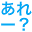
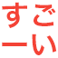

# Decomoji List

jp-en compatible table includes some jokes. Patches welcome!

|Decomoji|Default Code|Japanese|
|:---:|:---:|:---:|:---:|
||`:are-:`|あれー？|
||`:daijoubudayo:`|大丈夫だよ！|
||`:hayakuhayaku-:`|はやくはやくー！||
||`:hidoiyo-:`|ひどいよー！|
||`:nanikore-:`|nanikore-|
||`:mezurashiine:`|めずらしいね|
||`:muzukashi-:`|むずかしー！|
||`:nanikore-:`|なにこれー？|
||`:shitteta-:`|知ってたー？|
||`:sounano-:`|そうなのー!?|
||`:sugo-i:`|すごーい|
||`:tanosi-:`|たのしー|
||`:u-n:`|うーん？|
||`:wa-i:`|わーい！”|
||`:wakannaiya:`|わかんないや|
||`:yakouseidakara:`|夜行性だからっ！|

